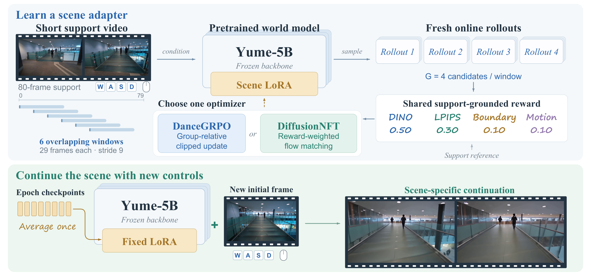
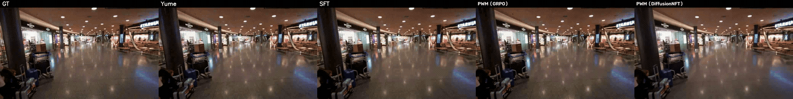

# PWM: Personalized World Models with Online Reinforcement Learning

> Zhexin Lou¹*, Guancheng Lu²*, Zeyu Zhang¹*†, Yi Zhang¹, Yang Zhao³, Hao Tang¹‡
>
> ¹ School of Computer Science, Peking University · ² Northwestern University · ³ La Trobe University
>
> *Equal contribution. †Project lead. ‡Corresponding author.

### [Website](https://aigeeksgroup.github.io/PWM) | [Dataset](https://huggingface.co/datasets/AIGeeksGroup/PWM-Bench) | [Model weights](https://huggingface.co/AIGeeksGroup/PWM)

## Introduction

PWM customizes interactive world models from short scene videos through online reinforcement learning. A frozen Yume-5B backbone supplies the action-conditioned generation prior, while a compact scene-specific LoRA learns the target environment's visual identity.

The framework supports DanceGRPO and DiffusionNFT as alternative reward-guided optimization methods. Both use native 29-frame generation windows and a shared reward for scene appearance, visual continuity, and motion. The final adapter averages the corresponding LoRA tensors from all eight training epochs.

PWM-Bench contains 150 customization tasks: 50 Indoor, 50 Outdoor, and 50 Gaming scenes. Each task provides an 80-frame support video and a temporally later, non-overlapping 145-frame test continuation. Evaluation uses three paired seeds (42, 123, 777).

## Method Overview

[](assets/pwm_method.pdf)

## Qualitative Comparison



Left to right: **GT · Native Yume · SFT · PWM (DanceGRPO) · PWM (DiffusionNFT)**. All generated panels use seed 777 for the same shopping-mall scene. The preview shows the full 145-frame continuation, displayed at 8 fps after temporal subsampling from the 16 fps source.

[Watch more examples on the project website](https://aigeeksgroup.github.io/PWM/).

## Model Weights

Scene-specific LoRA checkpoints are available on Hugging Face: [AIGeeksGroup/PWM](https://huggingface.co/AIGeeksGroup/PWM).

PWM weights are **scene-specific LoRA adapters**, used together with the frozen [Yume-5B backbone](https://huggingface.co/stdstu123/Yume-5B-720P).

| File | Purpose |
| --- | --- |
| `lora_ep0.pt` through `lora_ep7.pt` | Adapter weights saved after each of eight training epochs. |
| `lora_soup_all.pt` | Final inference adapter: element-wise mean of all eight epoch adapters. |

DanceGRPO and DiffusionNFT produce separate adapters for each scene. Use the adapter matching the target scene and optimization method. A soup averages the stored LoRA factor tensors and retains rank 8; inference loads a single adapter.

## Environment Setup

Use Python 3.10 with a CUDA-capable PyTorch environment. The training environment uses PyTorch 2.5.0 with CUDA 12.1 and FlashAttention 2.7.0.post2.

```bash
git clone https://github.com/AIGeeksGroup/PWM.git
cd PWM
python -m pip install torch==2.5.0 torchvision==0.20.0 --index-url https://download.pytorch.org/whl/cu121
python -m pip install -r requirements.txt
python -m pip install flash-attn==2.7.0.post2 --no-build-isolation
python scripts/setup_yume.py
```

The setup script retrieves the pinned Yume revision and installs the PWM sampling files into `third_party/YUME`. Download the base model separately:

```bash
hf download stdstu123/Yume-5B-720P --local-dir weights/Yume-5B-720P
```

## Data Preparation

Download [PWM-Bench from Hugging Face](https://huggingface.co/datasets/AIGeeksGroup/PWM-Bench):

```bash
hf download AIGeeksGroup/PWM-Bench --repo-type dataset --local-dir data/PWM-Bench
```

Scene directories are organized under `indoor/`, `outdoor/`, and `gaming/`. For example, `indoor/indoor1/` contains `data.h5`, train/test videos, captions, and annotations.

PWM-Bench comprises 150 independent first-person customization tasks (Table 1 of the paper):

| Domain | Tasks | Video source | Control source |
| --- | ---: | --- | --- |
| Indoor | 50 | EgoVid-5M, InCrowd-VI, YouTube | VIO / visual motion |
| Outdoor | 50 | EgoVid-5M, YouTube | VIO / visual motion |
| Gaming | 50 | MineDojo (Minecraft) | Scripted-agent logs |

Each task contains an 80-frame support segment and a temporally later, non-overlapping 145-frame test segment from the same scene. Videos are processed at 832 × 480. Adaptation and checkpoint averaging use only the support segment; held-out test frames are used only for evaluation. The shared control interface comprises translation commands (W/A/S/D), a camera-direction token, and three continuous motion magnitudes.

Each source scene directory must be named with its scene identifier and contain `data.h5` with the matching top-level scene group. The preparation script validates the 80-frame support and 145-frame test segments and creates the caption sidecar and training-window captions.

For example, prepare the downloaded `indoor1` scene:

```bash
python scripts/prepare_data.py \
  --scene-dir data/PWM-Bench/indoor/indoor1 \
  --out prepared/indoor1
```

## Usage

Replace `SCENE_ID` below with the prepared scene identifier (for example, `indoor1`).

The commands below use the entry points currently included in this repository. Choose a new output directory for each run.

### Train a DanceGRPO adapter

```bash
python scripts/run_scene.py train \
  --method rl \
  --prepared prepared/SCENE_ID \
  --out outputs/SCENE_ID/dancegrpo
```

Training saves eight epoch checkpoints and constructs `outputs/SCENE_ID/dancegrpo/lora_soup_all.pt`. The shared configuration uses rank 8, alpha 16, six native support windows, group size 4, and reward weights 0.50/0.30/0.10/0.10 for feature fidelity, perceptual appearance, initial-frame consistency, and motion magnitude matching.

### Train a DiffusionNFT adapter

```bash
python scripts/run_scene.py train \
  --method nft \
  --prepared prepared/SCENE_ID \
  --out outputs/SCENE_ID/diffusionnft
```

DiffusionNFT is an alternative optimization instantiation of PWM. It uses the same frozen backbone, rank-8 / alpha-16 LoRA, support windows, reward weights, and eight-epoch adapter average as the DanceGRPO configuration above.

| Setting | DiffusionNFT |
| --- | --- |
| Rollouts per support window | 4, with independent initial noise |
| Support windows | Six 29-frame windows starting at 0, 9, 18, 27, 36, 45 |
| Learning rate | `5e-5` |
| Rollout steps / SDE beta | 4 / 0.5 |
| Update passes | 4 per epoch, accumulating all six windows |
| Forward-noise draws | 2 per rollout |
| NFT beta | 0.5 |
| Reward normalization | Window-centered rewards scaled by running reward standard deviation, clipped to [-1, 1] and mapped to [0, 1] |
| Noise levels | Sampled from the four-step shifted sampler schedule |
| Additional anchor / EMA / KL | Disabled |
| Final adapter | Mean of `lora_ep0.pt` through `lora_ep7.pt` |

Each epoch gathers 24 rollouts and forms 48 forward-noised training examples, reused for four update passes. The NFT objective mixes positive and negative velocity-matching losses using the bounded reward weights. `--nft_zscale 2.0` is retained in the configuration; global reward normalization uses the running standard deviation instead.

Use the shared inference and evaluation commands below with `--lora outputs/SCENE_ID/diffusionnft/lora_soup_all.pt`. Training requires a GPU with sufficient memory for Yume-5B, LoRA optimization, and the reward models. CPU checks validate configuration and data contracts; they do not constitute an end-to-end GPU training run.

If you already installed an earlier overlay, create a fresh one with `python scripts/setup_yume.py --destination third_party/YUME-nft` and pass `--yume third_party/YUME-nft` to training and inference.

### Generate paired PWM and Native continuations

```bash
python scripts/run_scene.py infer \
  --prepared prepared/SCENE_ID \
  --lora outputs/SCENE_ID/dancegrpo/lora_soup_all.pt \
  --out outputs/SCENE_ID/inference
```

Inference runs all three seeds. Omit `--lora` for Native-only generation. Use `--weights` and `--yume` to override the base-model and Yume checkout paths. Add `--dry-run` to inspect a command without loading models.

### Evaluate customization

```bash
python scripts/run_scene.py evaluate \
  --prepared prepared/SCENE_ID \
  --videos outputs/SCENE_ID/inference \
  --out outputs/SCENE_ID/evaluation
```

Following Section 4 and Appendix C of the paper, the customization-fidelity score is `S = D_pair + 0.5 D_hall` (lower is better):

- `D_pair` is the mean cosine distance between time-aligned generated and ground-truth frames over all 145 test frames, using DINOv2-base CLS features.
- `D_hall` is the fraction of generated frames flagged for introducing a person, vehicle, or animal class absent from the first ground-truth test frame, using CLIP ViT-B/32 and the paper's fixed positive/negative prompt pairs. A class is marked present initially when its score exceeds 0.30; an initially absent class triggers a generated-frame flag when its score exceeds 0.50. Each frame contributes at most one flag.

Native, SFT, and PWM use the same initial context, controls, native 29-frame generation geometry, decoding settings, and 145-frame horizon. Evaluation uses deterministic inference with paired seeds 42, 123, and 777. Scores are averaged over seeds within each scene before computing scene-level gains and aggregating equally across scenes. The evaluation score is separate from the training reward, which uses DINOv2-small CLS and patch features alongside LPIPS, initial-frame consistency, and motion magnitude matching.

### Train the matched SFT baseline

```bash
python scripts/run_scene.py train \
  --method sft \
  --prepared prepared/SCENE_ID \
  --out outputs/SCENE_ID/sft
```

## Citation

```bibtex
@misc{lou2026pwm,
  title={PWM: Personalized World Models with Online Reinforcement Learning},
  author={Lou, Zhexin and Lu, Guancheng and Zhang, Zeyu and Zhang, Yi and Zhao, Yang and Tang, Hao},
  year={2026},
  url={https://github.com/AIGeeksGroup/PWM}
}
```

## Acknowledgements

PWM builds on [Yume](https://github.com/stdstu12/YUME), with online optimization instantiations based on DanceGRPO and DiffusionNFT.
